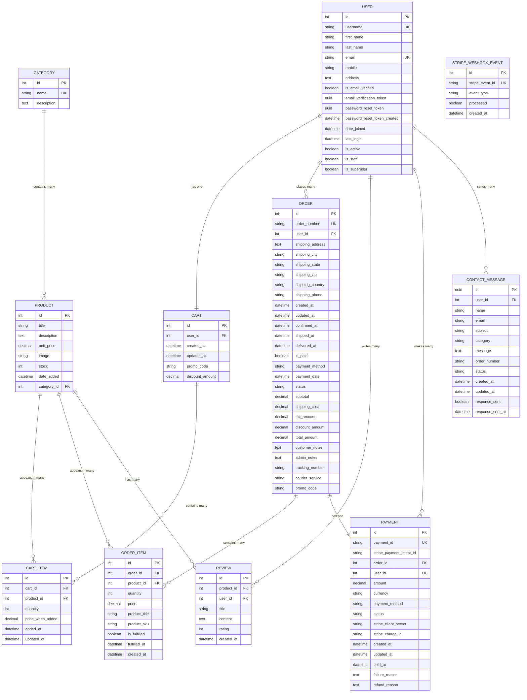

# Amazon Clone - ERD Visual Formats

## Mermaid.js ERD (Copy this to mermaid.live or use in Markdown)



## PlantUML Format (Copy this to plantuml.com)


## DBDiagram.io Format (Copy this to dbdiagram.io)

```sql
Table users {
  id integer [primary key]
  username varchar(150) [unique]
  first_name varchar(30)
  last_name varchar(30)
  email varchar(254) [unique]
  mobile varchar(50)
  address text
  is_email_verified boolean
  email_verification_token uuid
  password_reset_token uuid
  password_reset_token_created datetime
  date_joined datetime
  last_login datetime
  is_active boolean
  is_staff boolean
  is_superuser boolean
}

Table categories {
  id integer [primary key]
  name varchar(255) [unique]
  description text
}

Table products {
  id integer [primary key]
  title varchar(255)
  description text
  unit_price decimal(10,2)
  image varchar(255)
  stock smallint
  date_added datetime
  category_id integer
}

Table carts {
  id integer [primary key]
  user_id integer
  created_at datetime
  updated_at datetime
  promo_code varchar(50)
  discount_amount decimal(10,2)
}

Table cart_items {
  id integer [primary key]
  cart_id integer
  product_id integer
  quantity integer
  price_when_added decimal(10,2)
  added_at datetime
  updated_at datetime
}

Table orders {
  id integer [primary key]
  order_number varchar(20) [unique]
  user_id integer
  shipping_address text
  shipping_city varchar(100)
  shipping_state varchar(100)
  shipping_zip varchar(20)
  shipping_country varchar(100)
  shipping_phone varchar(20)
  created_at datetime
  updated_at datetime
  confirmed_at datetime
  shipped_at datetime
  delivered_at datetime
  is_paid boolean
  payment_method varchar(20)
  payment_date datetime
  status varchar(20)
  subtotal decimal(10,2)
  shipping_cost decimal(10,2)
  tax_amount decimal(10,2)
  discount_amount decimal(10,2)
  total_amount decimal(10,2)
  customer_notes text
  admin_notes text
  tracking_number varchar(100)
  courier_service varchar(100)
  promo_code varchar(50)
}

Table order_items {
  id integer [primary key]
  order_id integer
  product_id integer
  quantity integer
  price decimal(10,2)
  product_title varchar(255)
  product_sku varchar(100)
  is_fulfilled boolean
  fulfilled_at datetime
  created_at datetime
}

Table payments {
  id integer [primary key]
  payment_id varchar(50) [unique]
  stripe_payment_intent_id varchar(200)
  order_id integer
  user_id integer
  amount decimal(10,2)
  currency varchar(3)
  payment_method varchar(20)
  status varchar(20)
  stripe_client_secret varchar(500)
  stripe_charge_id varchar(200)
  created_at datetime
  updated_at datetime
  paid_at datetime
  failure_reason text
  refund_reason text
}

Table reviews {
  id integer [primary key]
  product_id integer
  user_id integer
  title varchar(255)
  content text
  rating smallint
  created_at datetime
}

Table contact_messages {
  id uuid [primary key]
  user_id integer
  name varchar(100)
  email varchar(254)
  subject varchar(200)
  category varchar(20)
  message text
  order_number varchar(50)
  status varchar(15)
  created_at datetime
  updated_at datetime
  response_sent boolean
  response_sent_at datetime
}

// Relationships
Ref: users.id - carts.user_id
Ref: users.id < orders.user_id
Ref: users.id < reviews.user_id
Ref: users.id < payments.user_id
Ref: users.id < contact_messages.user_id

Ref: categories.id < products.category_id

Ref: products.id < cart_items.product_id
Ref: products.id < order_items.product_id
Ref: products.id < reviews.product_id

Ref: carts.id < cart_items.cart_id

Ref: orders.id < order_items.order_id
Ref: orders.id - payments.order_id
```

## How to Use These Formats:

### 1. **Mermaid.js** (Recommended)
- Copy the Mermaid code
- Go to [mermaid.live](https://mermaid.live)
- Paste the code and generate a beautiful ERD
- Export as PNG, SVG, or PDF

### 2. **PlantUML**
- Copy the PlantUML code
- Go to [plantuml.com](http://www.plantuml.com/plantuml/uml/)
- Paste the code and generate the diagram
- Download as PNG or SVG

### 3. **DBDiagram.io**
- Copy the SQL-like syntax
- Go to [dbdiagram.io](https://dbdiagram.io)
- Paste the code for an interactive database diagram
- Export as PDF or PNG

### 4. **VS Code Extensions**
You can also install these VS Code extensions to view the diagrams directly:
- **Mermaid Preview** - for Mermaid diagrams
- **PlantUML** - for PlantUML diagrams

These tools will generate professional-looking ERD images that you can use in presentations, documentation, or share with your team!
